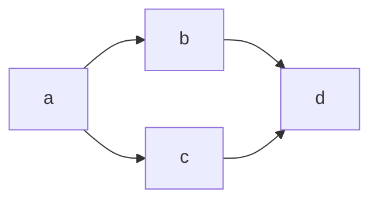
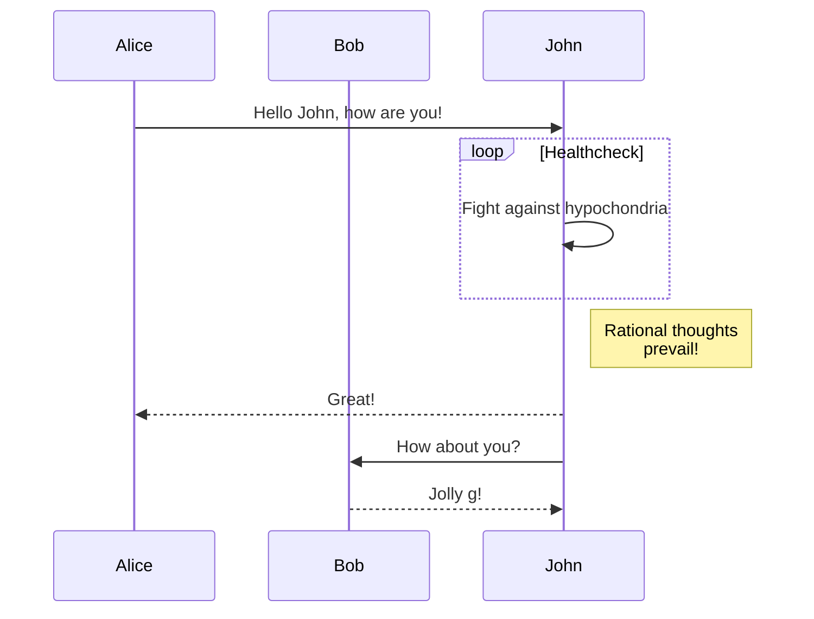
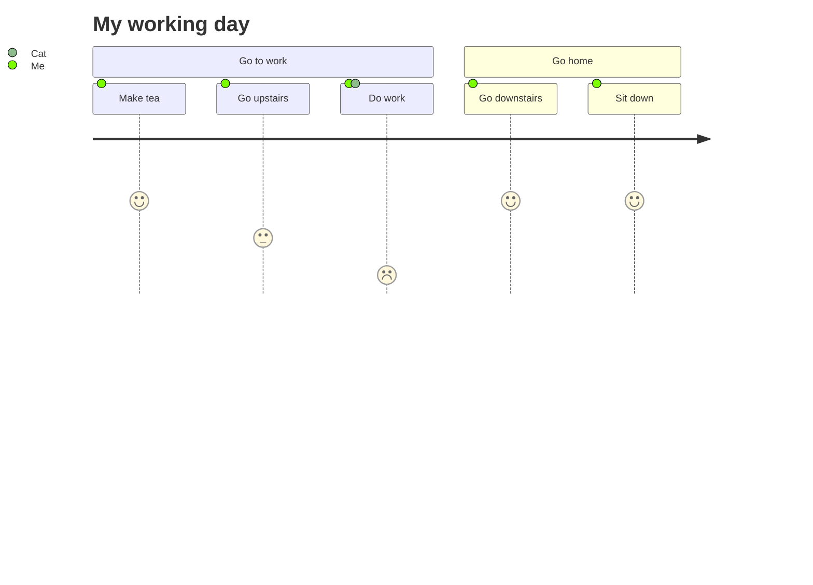

```python
import this
```

# Inline equations

$\Sigma_{i=0}^\infty \frac{1}{n} = 2$ is a fact. However:

$$\sin x = 12$$

$\exp{2}$

$$\alpha =2$$

$a=b$

You can also have things inline like \alpha or $\alpha$.

This is how it looks like :).

Does it work a bit better like this?
\begin{equation}
a=2
\end{equation}

# Equations blocks

This is an equation:
\begin{equation}
y+2 = 3
\end{equation}

This is a system of equations:
\begin{align*}
x^2+y^2 & = 2 \\
\sin(y) & = 0.2
\end{align*}

$$\sin x = 1$$

This is Euler's formula:
\begin{eqnarray*}
e^{i\pi} + 1 & = & 0.
\end{eqnarray*}

Katex only syntax
$$
\begin{aligned}
x^2+y^2 & = 2 \\
\sin(y) & = 0.5 \\
x &= y
\end{aligned}
$$


\begin{align}
1+2 =3
\end{align}

# [Mermaid](https://mermaid-js.github.io/mermaid/#/README) Graphs

## [Flowchart](https://mermaid-js.github.io/mermaid/#/flowchart)



## [Sequence Diagram](https://mermaid-js.github.io/mermaid/#/sequenceDiagram)



# [User Journey Diagram](https://mermaid-js.github.io/mermaid/#/user-journey)


