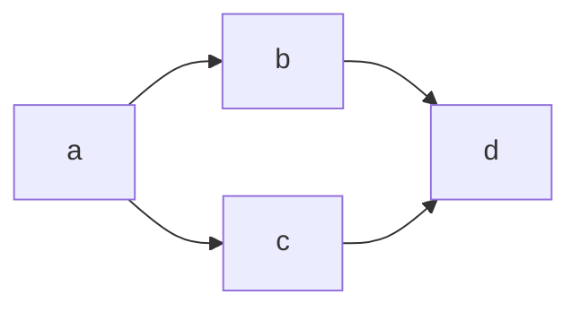
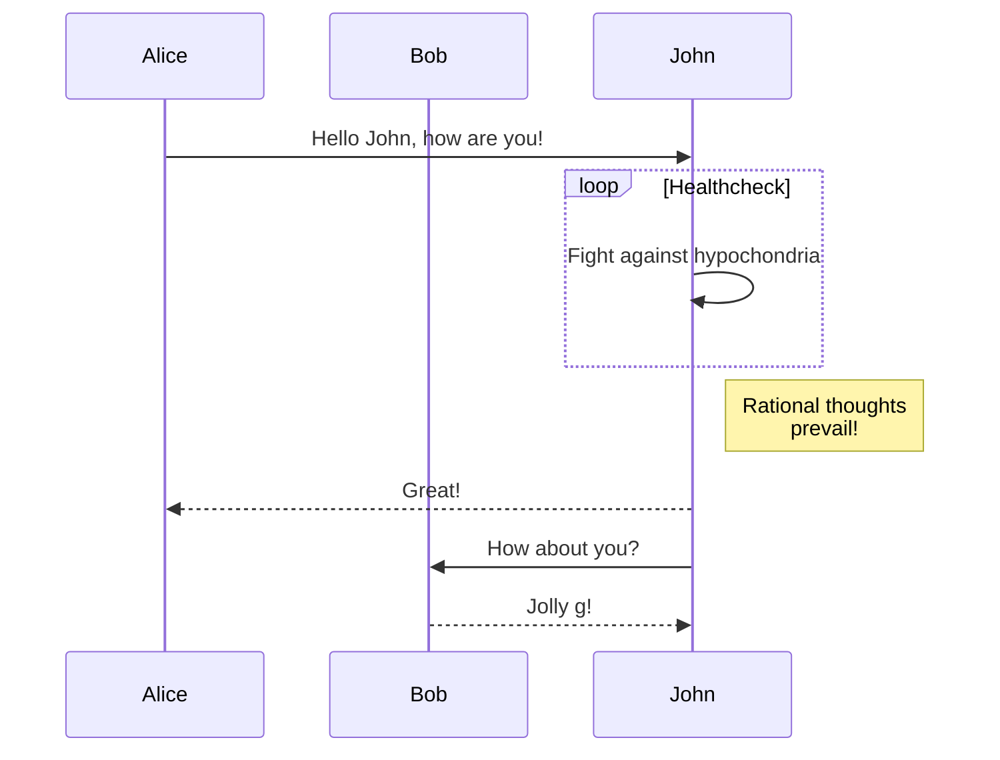
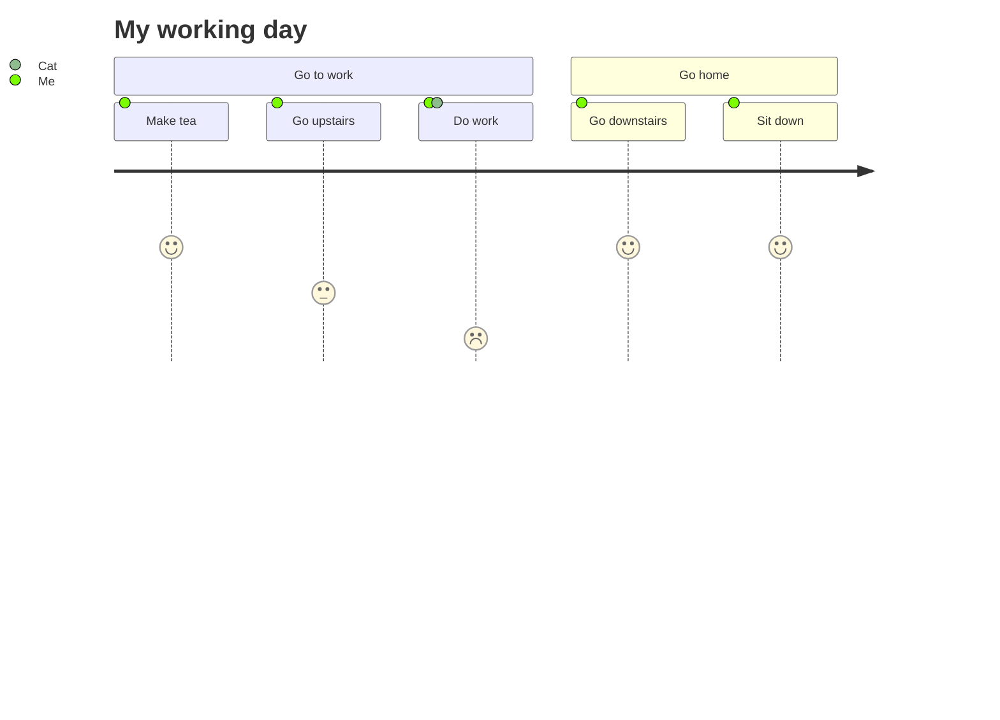

# [Mermaid](https://mermaid-js.github.io/mermaid/#/README) Graphs

## [Flowchart](https://mermaid-js.github.io/mermaid/#/flowchart)

## [Sequence Diagram](https://mermaid-js.github.io/mermaid/#/sequenceDiagram)

# [User Journey Diagram](https://mermaid-js.github.io/mermaid/#/user-journey)

